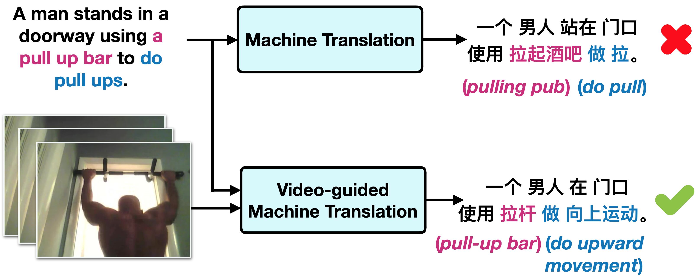

# Video-guided Machine Translation

This repo contains the starter code for the [VATEX Translation Challenge for Video-guided Machine Translation (VMT)](https://eric-xw.github.io/vatex-website/translation_2020.html), aiming at translating a source language description into the target language with video information as additional spatiotemporal context. 

VMT is introduced in our ICCV oral paper "VATEX: A Large-Scale, High-Quality Multilingual Dataset for Video-and-Language Research". 
VATEX is a new large-scale multilingual video description dataset, which contains over 41,250 videos and 825,000 captions in both English and Chinese and half of these captions are English-Chinese translation pairs. 
For more details, please check the latest version of the paper: [https://arxiv.org/abs/1904.03493](https://arxiv.org/abs/1904.03493).

<p align="demo">

</p>


## Prerequisites 
- Python 3.7
- PyTorch 1.4 (1.0+)
- nltk 3.4.5
## Training 

### 1. Download corpus files and the extracted video features
First, under the vmt/ directory, download train/val/test json file:
```
./data/download.sh
```

Then download the I3D video features from [here for trainval](https://vatex-feats.s3.amazonaws.com/trainval.zip) and [here for test](https://vatex-feats.s3.amazonaws.com/public_test.zip)
```
# set up your DIR/vatex_features for storing large video features
mkdir DIR/vatex_features

wget https://vatex-feats.s3.amazonaws.com/trainval.zip -P DIR/vatex_features
unzip DIR/vatex_features/trainval.zip
wget https://vatex-feats.s3.amazonaws.com/public_test.zip -P DIR/vatex_features
unzip DIR/vatex_features/public_test.zip

cd vmt/
ln -s DIR/vatex_features data/vatex_features
```

### 2. Training 
To train the baseline VMT model:
```
python train.py
```
The default hyperparamters are set in `configs.yaml`. 


## Evaluation
Run
```
python eval.py
```
Specify the model name in `configs.yaml`. The script will generate a json file for submission to the [VMT Challenge on CodaLab](https://competitions.codalab.org/competitions/24384).  

## Results

The baseline VMT model achieves the following performance on corpus-level bleu score (the numbers here are slightly different from those in the paper due to different evaluation setups. For fair comparison, please compare with the performance here):


| Model    | EN -> ZH | ZH -> EN |
| ---------|----------| -------- |
| BLEU-4   |   31.1   |   24.6   |

On the evaluation server, we report cumulative corpus-level BLEU score (up to 4-gram) and each individual n-gram score for reference, shown as B-1, ..., B-4. 

Model performance is evaluated by cumulative BLEU-4 score in the challenge.


## Reference 

Please cite our paper if you use our code or dataset:
```
@InProceedings{Wang_2019_ICCV,
author = {Wang, Xin and Wu, Jiawei and Chen, Junkun and Li, Lei and Wang, Yuan-Fang and Wang, William Yang},
title = {VaTeX: A Large-Scale, High-Quality Multilingual Dataset for Video-and-Language Research},
booktitle = {The IEEE International Conference on Computer Vision (ICCV)},
month = {October},
year = {2019}
}
```
